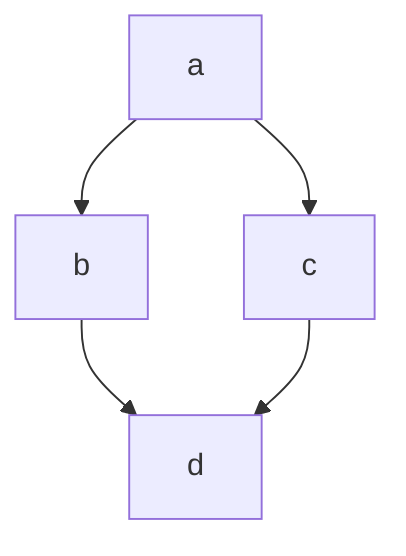

# markdown


# titulo = h1
## titulo = h2
### titulo = h3
#### titulo = h4
##### titulo = h5
###### titulo = h6

Parágrafo normal

Se você der espaços
entre linhas, então você
terá um novo parágrafo.

Quebra de linha  
com dois espaços  
ao final da linha. <br> é o mesmo \<br> que você encontra no html

**negrito**
__negrito__
==marcado==
sublinhado
~~riscado~~
*italico*
_italico_

Em um **paragrafo** podemos usar todos os anteriores

## Lista

1. ordenadas
2. quando você usa um numero , o
3.proximo item será automaticamente incrementados
    1. subitem
    2. outro sunitem
    2. outro subitem
        1.sub subitem

- Não ordenadas 
* Você pode usar um asterisco ou hifen 
+ sinal de mais também é aceito 

##### Só com o mesmo sinal 
- Não ordenadas 
- Você pode usar um asterisco ou hifen 
- sinal de mais também é aceito
    - subitem
    - subitem
    - subitem
- O correto é não misturar os sinais

## Links

[clique aqui](https://github.com/PsyJP/nome-que-eu-quiser)
[Não clique aqui](https://senac.com.br/)

[ancora](#markdown)

Aqui é um paragrafo com link [clique aqui](https://github.com/PsyJP/nome-que-eu-quiser "Titulo para esse link") ou aqui é um paragrafo com um link https://github.com/PsyJP/nome-que-eu-quiser

## imagens


## imagem com link 

[](https://www.bing.com/videos/riverview/relatedvideo?q=catapinbas+png&&mid=00D770516FE88C60C1D700D770516FE88C60C1D7&&mmscn=stvo&mcid=5C44A24DBBDB42A9BC30C3A01DD1B4B3&FORM=VRDGAR)

## citação
 
> Iniciar minha citação
 
> <br>
>Iniciar minha citação
> <br><br>
 
>Citação
>>Sub citação
 
>### Titulo dentro de uma citação
 
## toggle
<details>
    <summary>
    Clique aqui para ver o conteúdo
    </summary>
    Conteúdo
</details>
 
## separador
 
pode ser 3 traços
 
---
 
ou pode ser 3 asteriscos
 
***
 
## checklist
 
- [ ] ITEM 1
- [ ] ITEM 2
- [ ] ITEM 3
 
## tabela
 
| nome | idade |
| ---- | ----- |
|Diego |   33  |
|Queren|   22  |
 
| nome | idade |
| ---- | -----: |
|Diego |   33  |
|Queren|   22  |
 
| nome | idade |
| ---- | :-----: |
|Diego |   33  |
|Queren|   22  |
 
## código
 
Em linha usamos 1 acento grave para abrir o código e outro para fechar
 
` <h1> Eu sou um título</h1>`
<h1> Eu sou um título</h1>
 
`# Eu sou um Titulo `
 
# Eu sou um Titulo
 
`console.log('Olá, mundo!')`
 
### bloco de código
 
Usaremos 3 acentos graves para abrir, seguido da linguagem que eu quero, e para fechar mais 3 acentos graves.
 
``` html
<details>
    <summary>
    Clique aqui para ver o conteúdo
    </summary>
    Conteúdo
</details>
 
```

``` css

.comtainer{
    display:flez;
}

```

``` javascript

console.log('Olá, mundo!');

function dados(dados){
    console.log(dados);
}

```

## emojis

:rocket:
:smirk:
:elephant:
:smile:
:s


